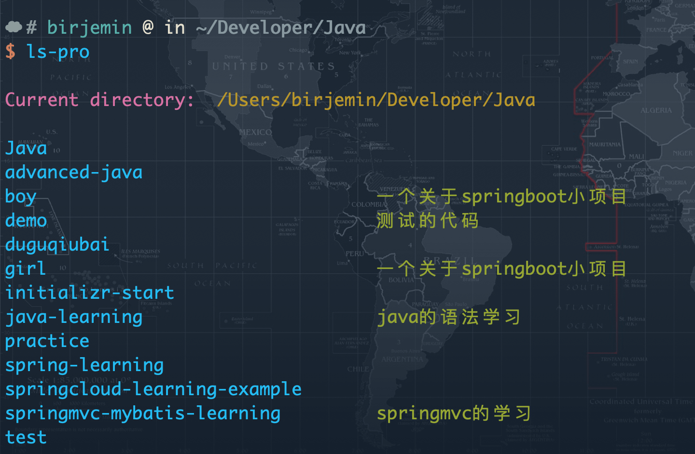
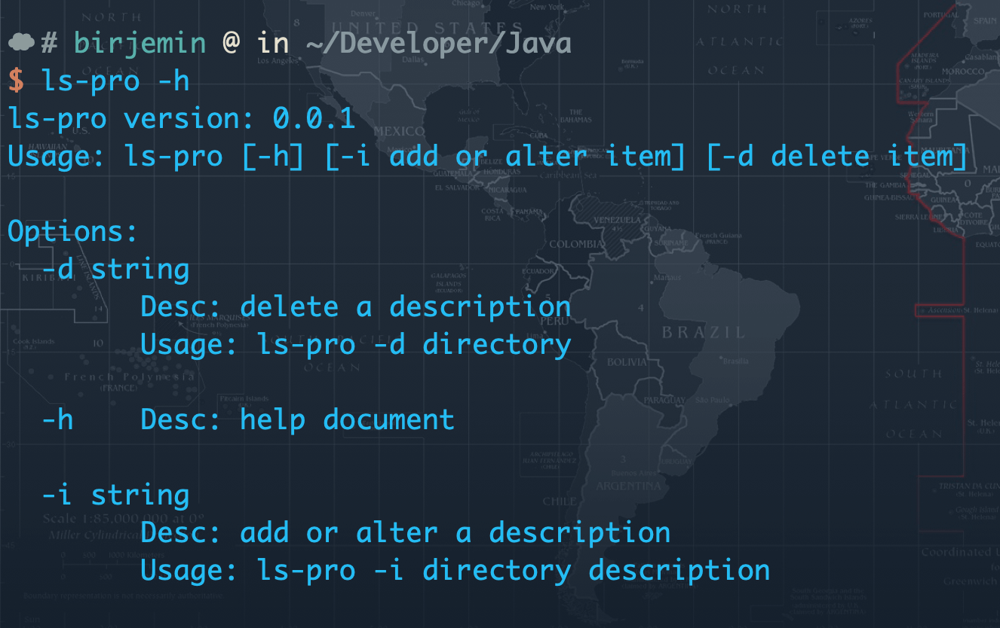

## ls pro

### 动机

- 手上有太多的项目，有时候也会clone很多项目来看，但是时间久了，有时候根本不知道每一个文件是啥项目


### 需求

- 希望有一个小公举，能和`ls`命令一样，可以查看每一个目录到时是啥项目
- 可以添加目录的备注
- 可以修改目录的备注
- 可以删除那里的备注
- 够简洁方便
- 最好是命令行模式

### 方案调研
采用sqlite3数据库保存数据即可，提供一个命令行工具，通过相应的指令进行操作

#### 技术栈调研

- <b>node<b>已经玩过 [cli](https://github.com/Birjemin/birjemin-cli)
- java
- golang
- php

### 效果





### 命令

```
ls-pro 默认展示
ls-pro -i ahh zhang 给目录添加备注
ls-pro -d ahh 给目录删除备注
ls-pro -h 帮助文档
```

### 备注

- 如何加入到系统命令中？？
    
    ```
    # ls-pro
    export PATH="/Users/birjemin/Developer/Go/src/ls-pro/:$PATH"
    ```

- 新需求

    ```
    暂时无
    ```